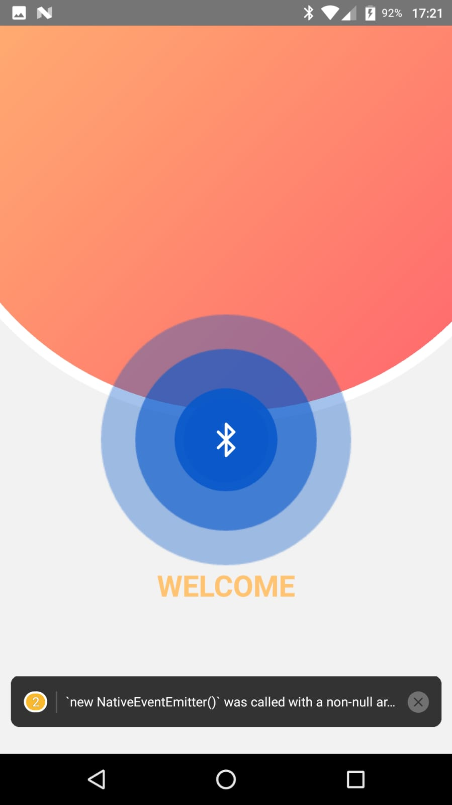

# react-native-ble-low-energy

# Bu projede React-native Bluetooth Low Energy ile cihazları listeleyeceğiz
### Used technologies
<ul style="list-style-type:disc">
   <li><a href="https://reactnative.dev/">React Native</a></li>
   <li><a href="https://reactnavigation.org/">React Navigation</a></li>
   <li><a href="https://github.com/dotintent/react-native-ble-plx">React Native BLE PLX </a></li>
   <li><a href="https://docs.swmansion.com/react-native-reanimated/">React Native Reanimated </a></li>
   <li><a href="https://github.com/nandorojo/moti/">Moti </a></li>
</ul>

### Running a project for android
<ul>
<li>npm install</li>
<li>npx react-native run-android</li>
</ul>

### 👋

### 👋👋👋
# https://medium.com/@bstkpnr/react-native-ile-bluetooth-ba%C4%9Flant%C4%B1s%C4%B1-nas%C4%B1l-kurulur-part-1-d200b89b6bf

